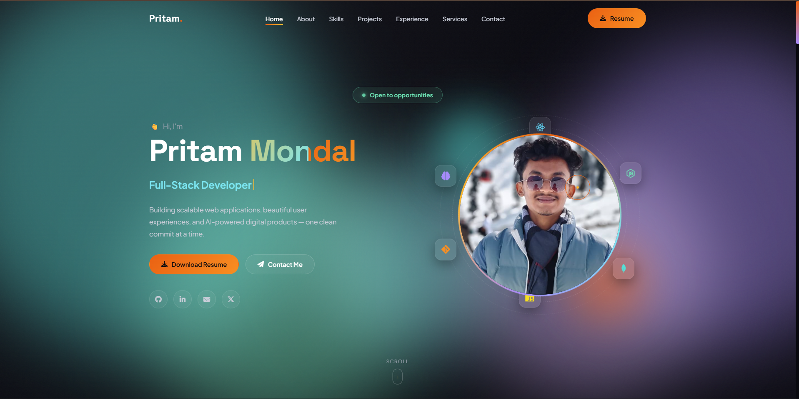
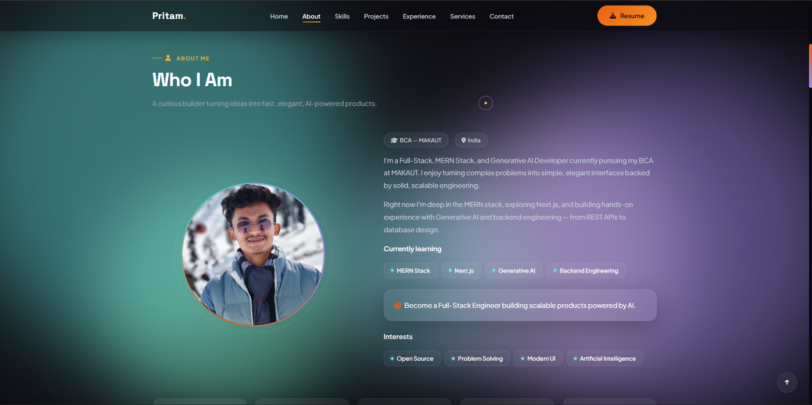
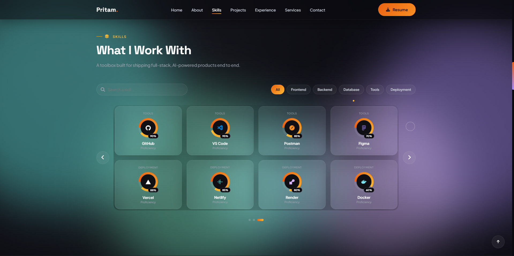
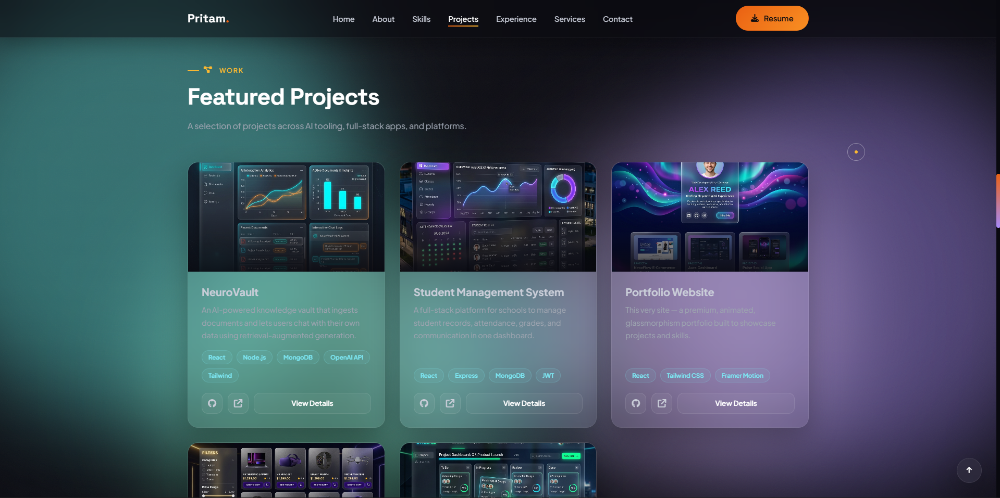
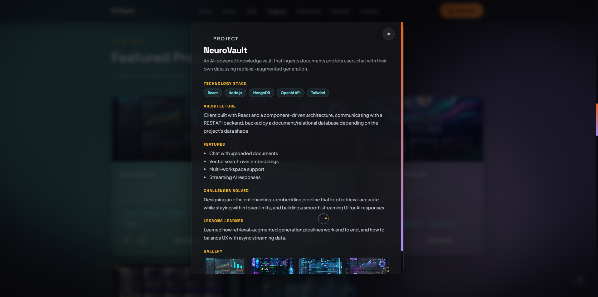
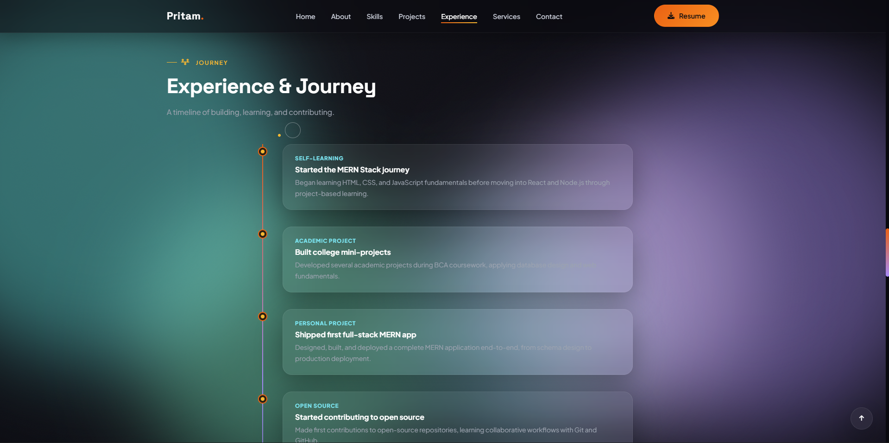
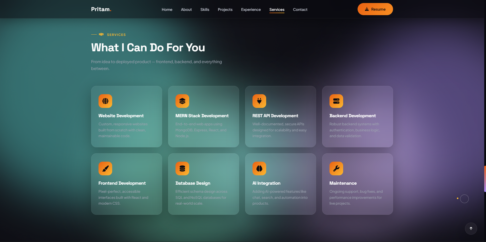
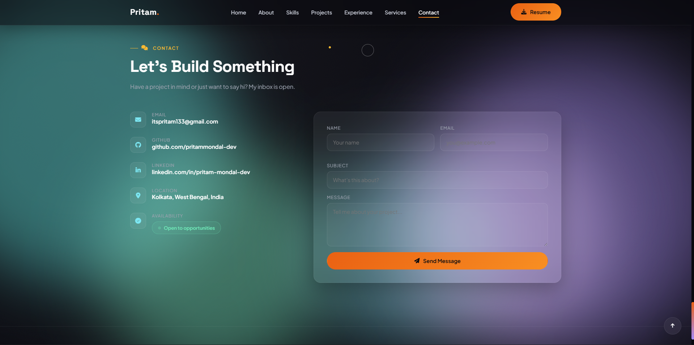

# Premium React Portfolio — Pritam Mondal

A premium, interactive, glassmorphism-designed personal portfolio showcasing full-stack capabilities, MERN developments, and Generative AI project integrations. Designed to feel responsive, fast, and modern.

## 🚀 Technologies Used

- **Frontend Core**: React 19, JavaScript (ES6+), Vite (Build Tool)
- **Styling**: Modern CSS3, CSS variables, CSS grid/flexbox, custom scrollbars, and keyframe animations
- **Effects & Motion**: Framer-like custom React hooks, glassmorphism UI elements, tilt-ring cursor lerps, and scroll-reveal triggers
- **Icons & Fonts**: Font Awesome 6, Simple Icons, Google Fonts (Space Grotesk & Plus Jakarta Sans)

## ✨ Key Features

- **Aurora Glow Effect**: Dynamic animated mesh gradients running in the background.
- **Glassmorphism Theme**: Translucent overlays with custom gradient borders, backdrops, and active highlights.
- **Dynamic Skill Slider**: Custom autoplay slider grouping and searching skills in categorization tabs.
- **Interactive Cursor Lerping**: Interactive custom cursor tracking coordinates with latency interpolation (lerp).
- **Responsive Layout**: Tailored overrides for tablet and mobile viewports.
- **Project Modal Dialogs**: Overlay card views expanding details, features, architectural specs, and galleries.
- **Global Theme Engine**: Future-proof `ThemeContext` tracking client theme preferences.

## 📂 Project Structure

```
portfolio/
├── public/                 # Static public assets
│   ├── favicon.ico         # Website favicon
│   ├── resume.pdf          # Resume document
│   └── robots.txt          # SEO crawler rules
├── src/
│   ├── assets/             # Reorganized asset buckets
│   │   ├── images/
│   │   │   ├── profile/    # Profile/avatar images
│   │   │   ├── projects/   # Project showcase graphics
│   │   │   ├── backgrounds/# Texture & aurora backgrounds
│   │   │   ├── logos/      # Brands & simple logos
│   │   │   └── icons/      # Custom graphic icons
│   │   ├── svg/            # Scalable Vector Graphics
│   │   ├── fonts/          # Embedded custom typography files
│   │   └── animations/     # Animation definitions (Lottie, etc.)
│   ├── components/         # Modular, reusable React components
│   │   ├── About/
│   │   ├── Achievements/
│   │   ├── AuroraBackground/
│   │   ├── Button/
│   │   ├── Contact/
│   │   ├── Experience/
│   │   ├── Footer/
│   │   ├── GlassCard/
│   │   ├── Hero/
│   │   ├── Loader/
│   │   ├── Navbar/
│   │   ├── Projects/
│   │   ├── SectionTitle/
│   │   ├── Services/
│   │   ├── Skills/
│   │   └── SocialIcons/
│   ├── config/             # Centered configuration layer
│   │   └── siteConfig.js   # Site settings (name, links, locations)
│   ├── context/            # React Context stores
│   │   └── ThemeContext.jsx# Light/dark theme control state
│   ├── data/               # Dynamic arrays and structures
│   │   ├── about.js        # Interests, learning lists & stats
│   │   ├── achievements.js # Counters and social profiles
│   │   ├── experience.js   # Timeline events
│   │   ├── projects.js     # Featured projects lists
│   │   ├── services.js     # Offered services
│   │   └── socialLinks.js  # Config-mapped social directories
│   ├── hooks/              # Custom reusable hooks
│   │   ├── useMousePosition.js
│   │   ├── useScrollSpy.js
│   │   └── useTypewriter.js
│   ├── layouts/            # Component layout wrappers
│   │   └── MainLayout.jsx  # Page scroll triggers, reveals, and layouts
│   ├── services/           # Backend / API integration folders
│   ├── styles/             # Modular system stylesheet files
│   │   ├── variables.css   # Tailored color and layout tokens
│   │   ├── globals.css     # General resets & display fonts
│   │   ├── scrollbar.css   # Custom webkit thumb tracks
│   │   ├── animations.css  # Orbit, wave, cursor, and glow keys
│   │   ├── utilities.css   # Glass system class styles
│   │   └── responsive.css  # Viewport size overrides
│   ├── utils/              # Common javascript tools
│   │   ├── constants.js    # Immutable constants
│   │   ├── helpers.js      # Global helper operations
│   │   └── scroll.js       # Window scrolling systems
│   ├── App.jsx             # Main site sections container
│   ├── index.css           # Global stylesheet importer
│   └── main.jsx            # DOM compiler mount entry point
├── index.html              # HTML DOM wrapper template
├── package.json            # Script dependencies
├── vite.config.js          # Vite config settings
└── README.md               # Documentation guide
```

## 🛠️ Getting Started

### Prerequisites

Make sure you have Node.js (v18+) and npm installed on your system.

### Installation

1. Clone or navigate to the repository directory:

   ```bash
   cd portfolio
   ```

2. Install the project dependencies:
   ```bash
   npm install
   ```

### Running Locally

To start the local development server with hot-module reloading:

```bash
npm run dev
```

The app will compile and be available on `http://localhost:3000`.

### Building the Project

To compile a highly-optimized production build (compiled output is served inside the `/dist` directory):

```bash
npm run build
```

To preview the production build locally:

```bash
npm run preview
```

## 🌐 Deployment

The compiled static files inside `dist/` can be deployed instantly to modern hosts:

- **Vercel**: Run `npx vercel` inside the root directory.
- **Netlify**: Drag-and-drop the `dist/` folder or run `npx netlify-cli deploy`.
- **Render**: Connect the GitHub repository and configure `npm run build` as build command and `dist` as publish directory.

## 📸 Screenshots

## Hero Section



## About Section



## Skills Section



## Projects Section



## Projects Model



## Experience Section



## Services Section



## Contact Section



---

## 📄 License

This project is licensed under the MIT License. See the LICENSE file for details.

## ✍️ Author

**Pritam Mondal**

- Email: [pritam.mondal.dev@gmail.com](mailto:pritam.mondal.dev@gmail.com)
- GitHub: [@pritammondal](https://github.com/pritammondal)
- LinkedIn: [@pritammondal](https://linkedin.com/in/pritammondal)
